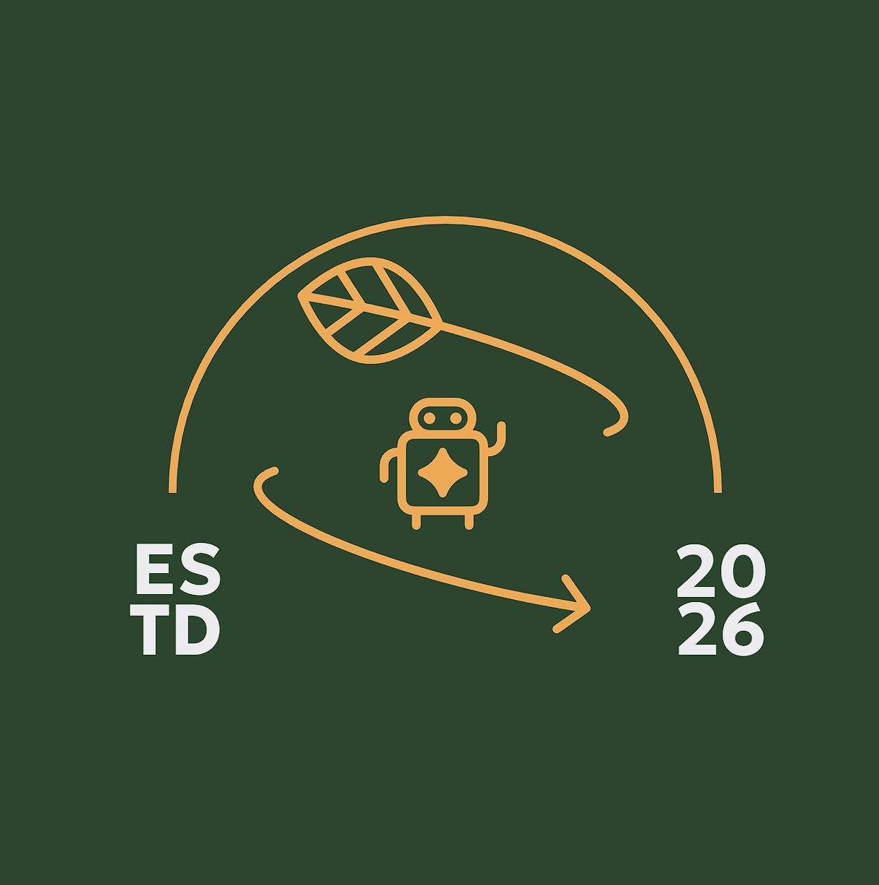

# Description

Recycling robot that collects rubbish and places it in designated areas.  
Includes code and CAD models with documentation.

## The Team

> - Abdalrahman Al-Zandi
>>Managing Director  
>>Mechanical Engineer
> - Torin Stanton-Andersson
>>Digital Systems Engineer  
>>Electronic and Wiring Engineer
> - David Mariani
>>Workshop Engineer  
>>Electronics and Wiring Engineer  
> - Aidan Johnstone
>>Software Engineer  
>>Personal Relations  
> - Lucy Grierson
>>Company Secretary  
>>Software Engineer  
> - Ben Albeson
>>Web Designer  
>>Digital Systems Engineer  

## Naming Convention For Files  

Lowercase and hyphen with group2 at end:  
***name-name-group2.c*** // Example of c file

Exception is when document is not created by the team.  
Then group2 is not used.
